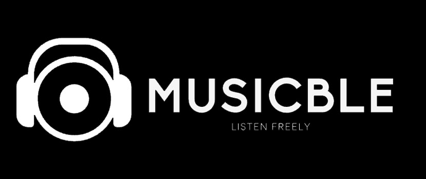
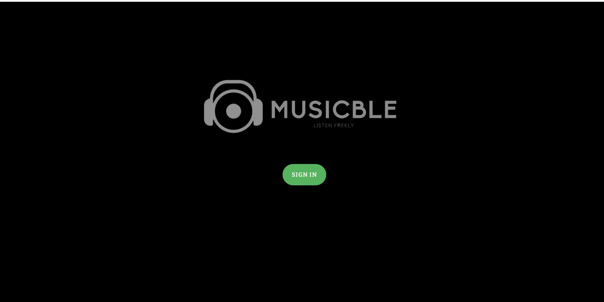
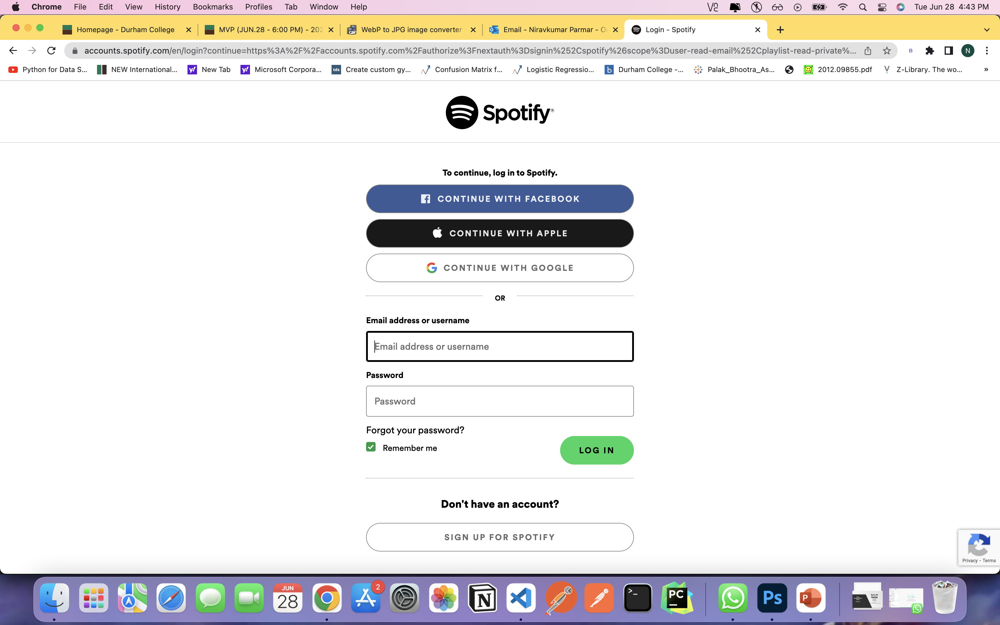
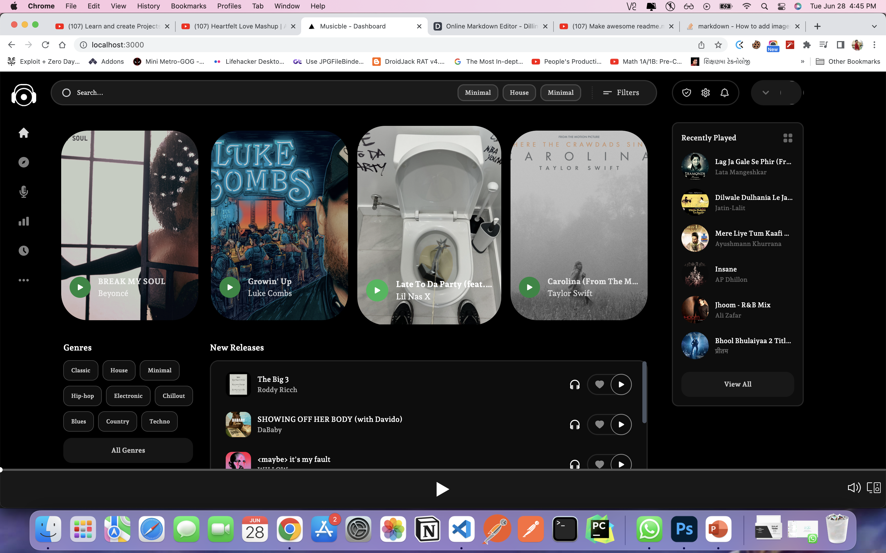
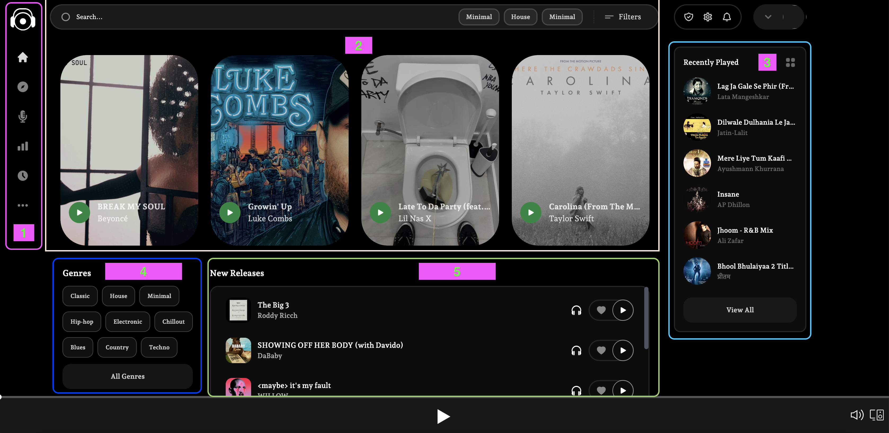

# Musicble - Listen Freely
## Minimum Viable Product | 28-06-2022

Group Members: 
* 100852206 || Jaykumar Patel
* 100855270 || Niravkumar Parmar
* 100849261 || Dhruval Patel
* 100856192 || Henil Shah
* 100858590 || Saheer Shaikh




## Goal 
- Our group will be working on a music recommendation system. Because music streaming programs are widely utilized by people of all ages all over the world, an intelligent music suggestion website appears to be a viable market and project concept.

- The ultimate goal is to create an Artificially Intelligent Music System that will propose music to users based on their listening habits and tastes. The project's purpose is to create a user-friendly webapp with AI algorithms operating on the backend to get the greatest accuracy and outputs possible.


## Features
- ✨ DONE ✨ Music Exploration
- ✨ DONE ✨ User Personalization
- ✨ WIP ✨ Music Recommendation based on user preference
- ✨ WIP ✨ Current Popular Hits
- ✨ WIP ✨ User Feedback

## Tech
Techstack of Musicble

- Next.JS - open-source web development framework built on top of Node.js enabling React-based web applications functionalities such as server-side rendering and generating static websites.

- React.JS - free and open-source front-end JavaScript library for building user interfaces based on UI components.

- Node.JS - evented I/O for the backend.

- Python - great UI boilerplate for modern web apps

- Express - fast node.js network app framework


## Installation

to run frontend application
```sh
cd frontend
npm install --legacy-peer-deps
npm run dev
```

ENV VARIABLES

```sh
SPOTIFY_CLIENT_ID=YOUR_SPOTIFY_ID
SPOTIFY_CLIENT_SECRET=YOUR_SPOTIFY_SECRET
NEXTAUTH_URL=http://localhost:3000
```

## Screenshot
1. Dashboard of Musicble


2. Social Login via <b>Spotify</b>


3. Simple Dashboard


4. Features of Dashboard

    1. Side bar of the application (Home | Explore | More)
    2. Thumbnail of searched song | Suggestions
    3. Previously played songs
    4. Genres - Recommended by Model Training <b>(WIP)</b>
    5. New Releases - based on region/country/location